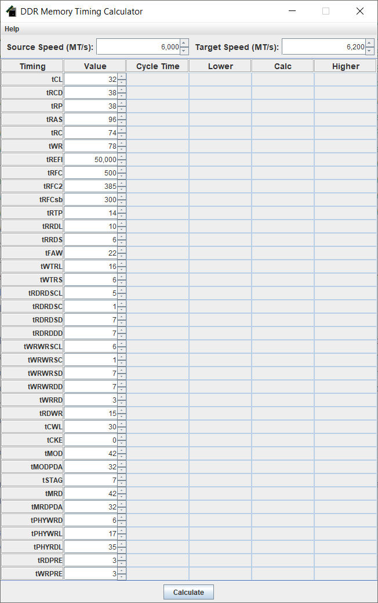
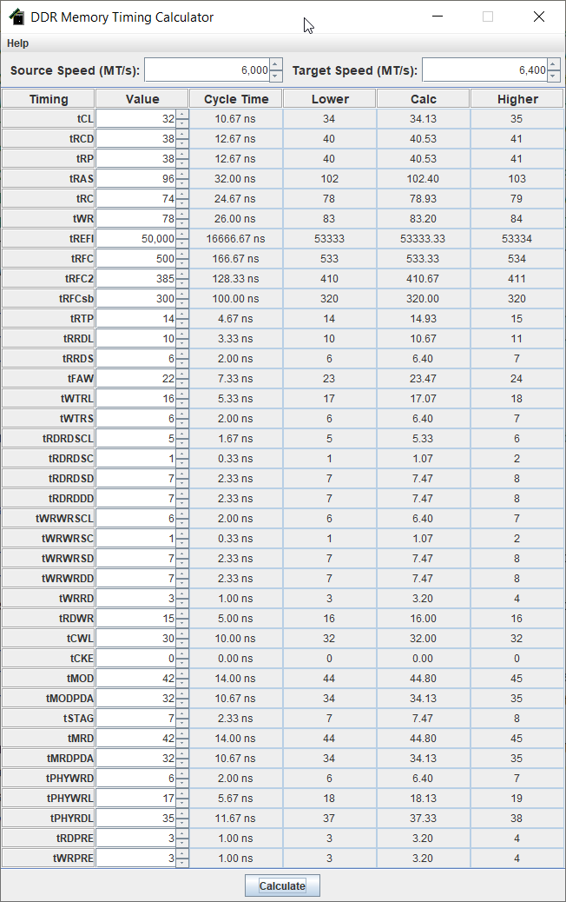
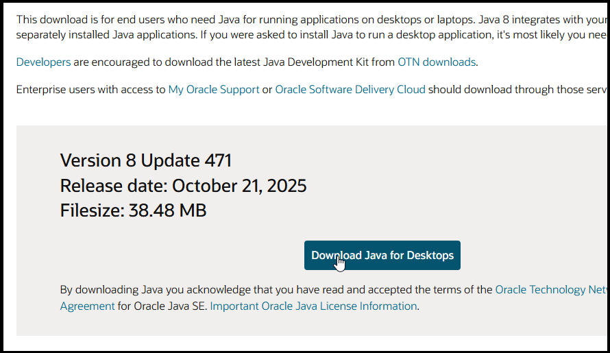
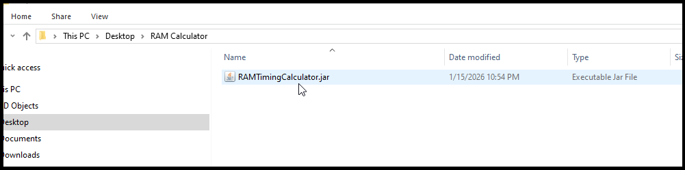

DDR5 Memory Timing Calculator

* * *

A small Java Swing application for calculating memory timing adjustments when overclocking.

What is it?
-----------

This app is a VERY simple calculator for use when overclocking DDR RAM. It allows you to enter current (assumed to be stable) DDR RAM speed and timings of your system, and a target speed you want to move to, and it will estimate the timing values you should set at your selected target speed. It uses a simple linear scaling algorithm (hence the "simple" part), so results are not guaranteed to be successful and will most likely need further tweaking on your part, especially if aiming for speeds on the upper end of what is possible, but it will at least give you a reasonable starting point for most timings that you can tweak further.

How to use it
-------------

Once you <a target="_blank" href="https://github.com/derekpage3/RAMTimingCalculator/releases/">download</a> and <a href="#headerInstall">install</a> the application, run the program. Once launched, you will see a basic screen as shown below:

All inputs will have defaults pre-loaded for you, which you can adjust as needed. All inputs are "spinner" fields and you can adjust the value up and down by clicking the arrows or pressing the UP and DOWN keys. The three inputs are:

1.  **Source Speed** - the DDR speed for which the entered timings are currently being used.
2.  **Target Speed** - the DDR speed you are trying to achieve and need converted timings for.
3.  **Timings** - In the table below you can select a value for each timing (as set at the source speed).

Once all values are set appropriately, click the **Calculate** button to calculate the estimated timings at the target speed.

The following calculations are provided for each timing:

*   **Cycle Time** (Informational only) - the calculated time (in nanoseconds) represented by that timing at the **Source Speed**
*   **Calc** - The raw numerical scaled value for the timing at the set **Target Speed**. These can often be decimal values, however, memory timings can only be specified in whole numbers, so the following additional values are also provided:

*   **Lower** - the calculated value, rounded down to the nearest whole number
*   **Higher** - the calculated value, rounded up to the nearest whole number.

For the majority of timings, the **Lower** value will equate to less time than that timing does at the **Source Speed**, and so is less likely to be stable at your target speed; the **Higher** value will be the safer bet, but isn't necessarily guaranteed to be stable either. As always, proper RAM stability tests are MANDATORY in this endeavor! See the <a href="#hdrStabilityTests">Stability Tests</a> section for recommended RAM stability tests.

And this is literally all there is to this application - it is a simple timing converter, nothing more, nothing less (though I may continue to enhance it in the future).

<h2 id="headerInstall">Installation and Launch</h2>

The application is provided in a single file which you can run on any computer.

#### 1\. Install Java (if you don't already have it installed)

The application is written entirely in Java, so you will need to have the Java Runtime Environment installed on your system to use the application. You can download the latest installer directly from Oracle <a target="_blank" href="https://www.java.com/en/download/">here</a>. Once downloaded, run the installer and it will install Java to your system and register it for use by Java programs.

#### 2\. Running the application

The application itself doesn't have or need an installer. Simply download the latest  <a target="_blank" href="https://github.com/derekpage3/RAMTimingCalculator/releases/">release</a> of the application and save it to a location of your choosing; once downloaded, if Java is installed correctly you should be able to double-click on it to run the application.

  
**NOTE:** If for some reason the double-click approach doesn't work, open a command prompt in the folder containing the application and run the following command:

_start javaw -jar RAMTimingCalculator.jar_

How does it work?
-----------------

RAM timings exist to govern the specific operations that CPU's perform against memory (write to memory, read from memory, refresh the data in the memory cells, etc.). Because memory cells can't perform any of these operations instantaneously, the CPU must wait a certain amount of time before sending the next command or attempting to READ/WRITE data after requesting it; failing to do so would corrupt your data and crash the entire system. Each of the standard RAM timings is used to specify the wait time for the operation it represents and these timings are all specified in terms of clock cycles.

A full explanation of all these timings and their underpinnings is well outside the scope of this tool (or frankly, myself) but for a basic explanation lets look at an example.

**Ex 1:** Consider an memory module running at DDR5-6000, with a **tCL** value of 32 - this tells the CPU that it must not attempt to read data from a column of memory for at least 32 clock cycles after issuing a READ command for it; at this speed, 32 clock cycles equates to 10.67 nanoseconds and it is this limit that must be maintained as clock speed is increased. As a general rule, these wait times are absolute values for a given memory stick and apply regardless of the speed the RAM is running (the RAM in our example needs 10.67ns to make the data available for reading, whether it is operating at DDR5-6000 or DDR5-8000); as such, as the RAM speed goes up, more clock cycles must be added to a given timing to maintain the same amount of wait time for that operation. This is a simple linear scaling, which is all this application is doing for each of the timings.

**Ex 2:** Consider a DDR5 RAM stick which requires a **tCL** of 20 at DDR5-3000. To maintain the same **tCL** when clocking the RAM up to DDR5-6000, it will require a value of at least 40 (double the speed, double the clock cycles to equate to the same amount of time, simple math).

#### **DISCLAIMER**

The above explanation is a **VERY** simplistic explanation of RAM timings, but it illustrates the general principle enough to understand how the application is calculating its results. In reality, RAM overclocking is never that simple as not all timings behave the same and scale the same way; for example:

*   Some timings are just absolute values, in terms of number of clock cycles, regardless of the speed the chip is operating at and so really should never need changing.
*   Other timings may not scale linearly as clock speed rises, as the time required of the chips in certain operations becomes higher and higher as the clock speed increases and the demands on them increase. This can even vary based on the CPU brand in use as well. For example, Intel 13 and 14th gen CPU's can generally achieve higher bandwidth at a given DDR5 speed than a Ryzen 7000/9000 series CPU can, due to differing CPU architectures around the memory subsystem, and as such a particular RAM stick may operate perfectly fine on one of those AMD CPU's at a given speed and timing profile, but when running with the same parameters on one of those Intel CPU's it will no longer be stable. There is also the simple reality of the "silicon lottery" and some CPU's will have stronger memory controllers than others of the same model.
*   Other timings (**tREFI** is a classic example) are dependent on both clock speed as well as other variable factors such as the temperature of the memory chips. For example, a long refresh interval (i.e., refreshing less often) may be perfectly stable at, say, DDR5-6000 on sticks that only require 1.35V to run at that speed, but once increased to DDR5-8000 that requires 1.55+ volts to run stable, and suddenly the large increase in temperature resulting from both increased voltage and the rate of memory operations will cause the chips to require being refreshed more often to maintain stability. In such a case, the linear scaled calculation for tREFI at DDR5-8000 is oversimplified and you will need to adjust it further.
*   All memory chips have some upper limit and simply are not capable of operating beyond that frequency and no amount of increasing voltage or memory timings will change it. Each brand, and model of memory chip they produce, have different limits in this regard so you have to research them to determine what your realistic range is for your specific RAM modules.

For all the reasons above and more, the application is **NOT** by any means a foolproof easy "one click and go auto-overclock" application that will reliably give you all the settings you need every time. It is a very simple tool, that uses very simple calculations, to give you a starting point to work with, but you will still need to put in the work required of any memory overclock.

There are many others who can, and have, explained this topic MUCH better than I ever could, so I wont attempt to dive any deeper here. See the <a href="#hdrRecResources">Recommended Sources</a> section for additional resources that further explore the topic.

<h2 id="hdrStabilityTests">Stability Tests</h2>

The following programs provide targeted stability tests for RAM, which are crucial to validating your overclock results are truly stable. While some are better than others, you'll want to use multiple, as some programs are more effective at catching certain types of memory instability than others are. Each program has its strengths and weaknesses, and the more stability tests you can pass, the more confident you can be in your overclock.

*   <a target="_blank" href="https://testmem5.com/">Testmem5</a> - One of the best program for RAM stability testing. (**NOTE:** You'll need to download the <a target="_blank" href="https://github.com/integralfx/MemTestHelper/blob/oc-guide/TM5-Configs/extreme%40anta777.cfg">extreme@anta777</a> test configuration specifically for this application.)
*   <a target="_blank" href="https://www.karhusoftware.com/ramtest/#introduction">Karhu RAM Test</a> - another solid RAM test application I have had success with exposing unstable RAM overclocks that other tests missed.
*   <a target="_blank" href="https://www.ocbase.com/">OCCT</a> - A general validation tool for all aspects of overclocking. Provides a RAM test for further validation.
*   <a target="_blank" href="https://hcidesign.com/memtest/download.html">HCI Memtest</a> - another stability test I've had good luck with in the past.

<h2 id="hdrRecResources">Recommended Sources</h2>

For a deeper dive into all things RAM overclocking, see the following excellent resources:

*   <a target="_blank" href="https://www.youtube.com/@ActuallyHardcoreOverclocking">Actually Hardcore Overclocking (AKA Buildzoid)</a>
*   <a target="_blank" href="https://github.com/integralfx/MemTestHelper/blob/oc-guide/DDR4%20OC%20Guide.md">integralfx DDR4 OC Guide</a> (much of this material applies to DDR5 as well).
*   <a target="_blank" href="https://gamersnexus.net/guides/3333-memory-timings-defined-cas-latency-trcd-trp-tras">GamersNexus - What Are Memory Timings? CAS Latency, tRCD, tRP, & tRAS</a>

FAQ
---

**Q: Why did you create this app? Aren't there tools like this already?**

**A:** There probably are a bunch of similar tools out there. Honestly, the calculations are so simple, you can build this in an Excel file in 5 minutes like I originally did. Truth is I only made this because I recently started learning Graphical User Interface development, which is a broad skillset and one that particularly requires lots of practice to become proficient with. When learning such things, it's best to build something relatively simple that solves a problem that you're completely familiar with, allowing you to devote all your thinking to learning the technology itself without having to think about the problem at the same time. I was in the process of overclocking the RAM on my AMD 7950X3D system, so the topic was on the mind and something I already understood well, so a timing calculator proved to be the perfect first app to build.

**Q: Where did the default values for the timings and clock speeds come from?**

**A:** They were simply the current DDR5 RAM speed and timings my 7950X3D system was running while I was writing the app. Nothing more to it than that. I got tired of entering the values in repeatedly while testing the app, so my own settings became the defaults.

**Q: What motherboard and RAM did you use to set the minimum and maximum values allowed for the timings?**

**A:** [ASRock X670E Taichi](https://www.asrock.com/mb/AMD/X670E%20Taichi/index.asp), and a G.Skill DDR5-6000 2x32GB kit ([F5-6000J3238G32GX2-TZ5RK](https://www.gskill.com/product/165/374/1649668575/F5-6000J3238G32GX2-TZ5RK-F5-6000J3238G32GA2-TZ5RK)).

**Q: Why no option to label the timings with the Intel naming instead?**

**A:** I don't have access to an Intel platform to grab those names (and the minimum and maximum values for each timing) from. If at some point I get ahold of one I will probably add the option.

**Q: Any chance you can add the ability to change the defaults? Save profiles? Other stuff?**

**A:** Possibly, if there's interest or I decide to spend more time on it as I continue learning GUI development. Feel free to leave comments on the GitHub project with ideas for things you would like to see. No guarantees, but I am open to suggestions.
